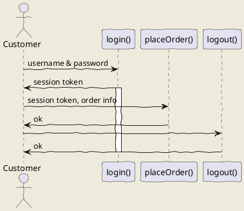
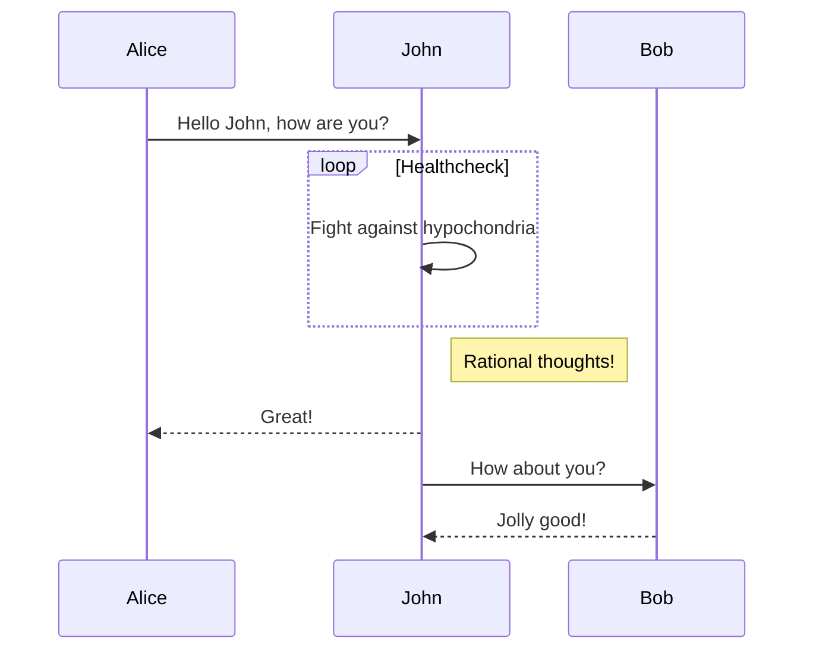

## uml: sequence diagram
Here I will embed PlantUML markup to generate a sequence diagram.

I can include as many plantuml segments as I want in my Markdown, and the diagrams can be of any type supported by PlantUML.

